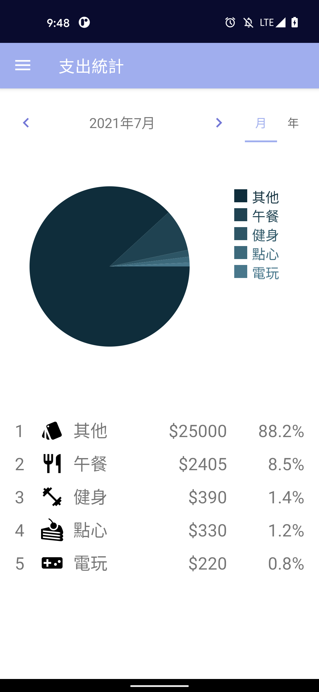
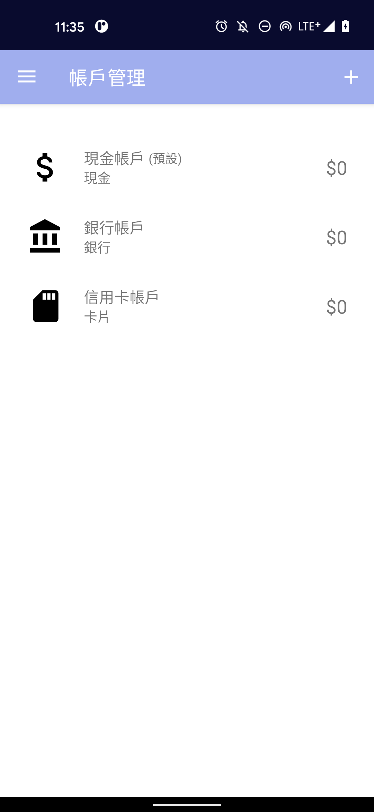
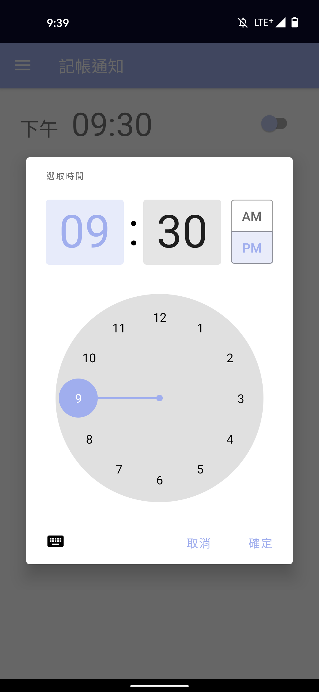

# Accounting Android App
It's an Android App that can record the expense and income daily, and count data monthly and annually.

## App Features
- record expense and income daily
- count data monthly and annually
- custom category for add expense or income
- remind accounting

## Develop Features
- Kotlin Project
- MVVM Architecture
- Dependency Injection(using Koin)
- Data layer with data sources(using Room)
- Unit Test
- UI Test
- Test-Driven Development(TDD)
- CI(using CircleCI)
- Single-activity architecture(using Navigation component)

## Screenshots

|  |  |  |
| ---------------------------------------------- | -------------------------------------------- | -------------------------------------------- |
|  |  |  |

## TODOs
- Feature - Budget
- Feature - Backup
- UI test with DI(Koin)
