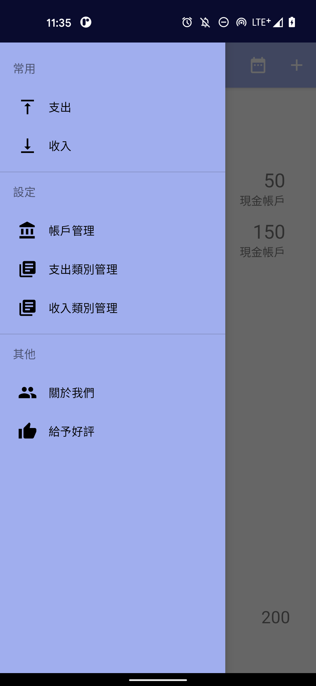
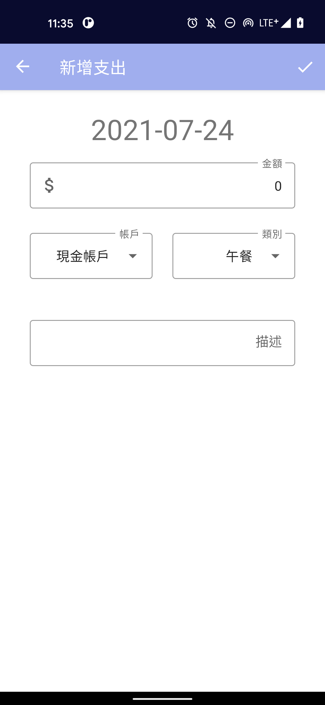
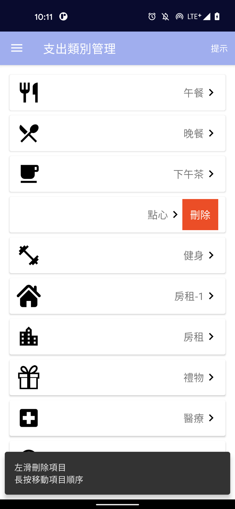

# Accounting Android App
It's an Android App that can record the expense and income daily, and count data monthly and annually.

//TODO: get it on google play store with picture

## App Features
- record expense and income daily
- count data monthly and annually
- custom category for add expense or income

## Develop Features
- Kotlin Project
- MVVM Architecture
- Dependency Injection(using Koin)
- Data layer with data sources(using Room)
- Unit Tests
- UI Tests
- Test-Driven Development(TDD)
- Single-activity architecture(using Navigation component)

## Screenshots

## TODOs
- Refactor
- UI test with DI(Koin)
- CI
- Deploy on Google Play Store

